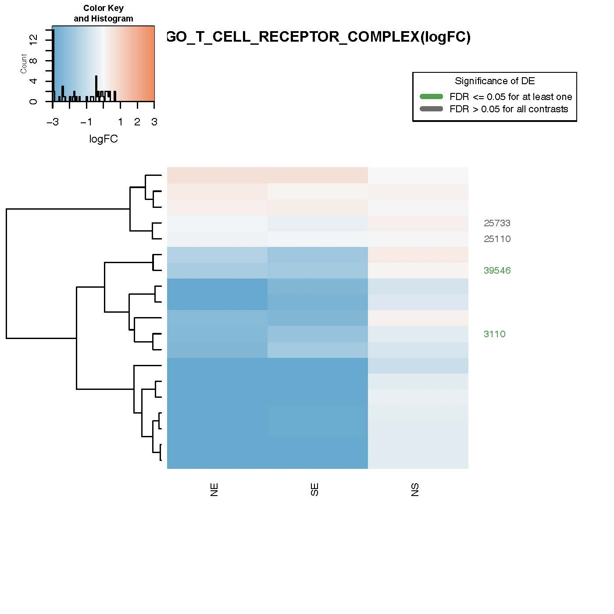
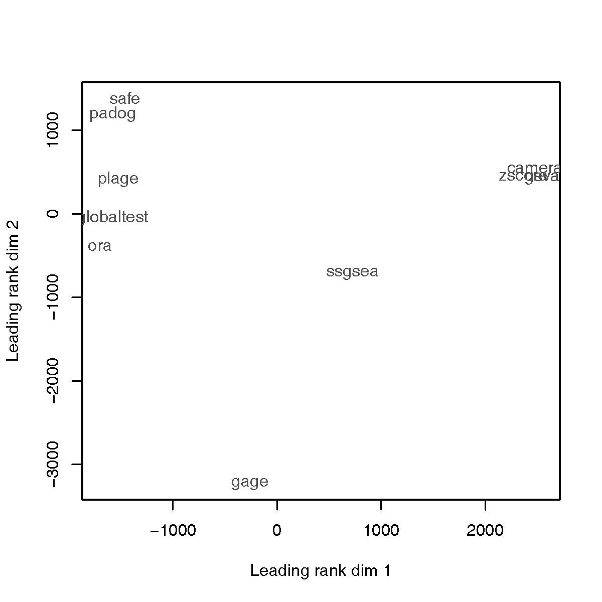
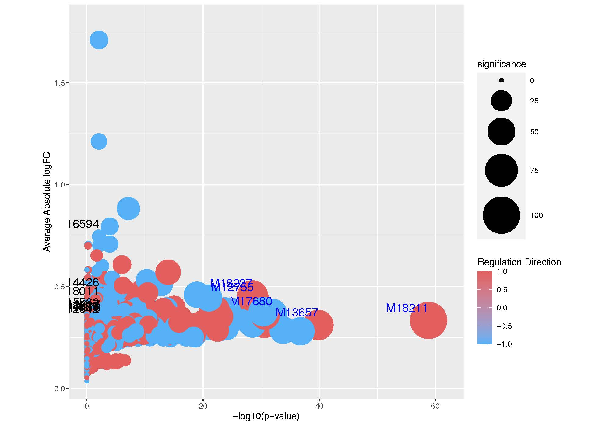
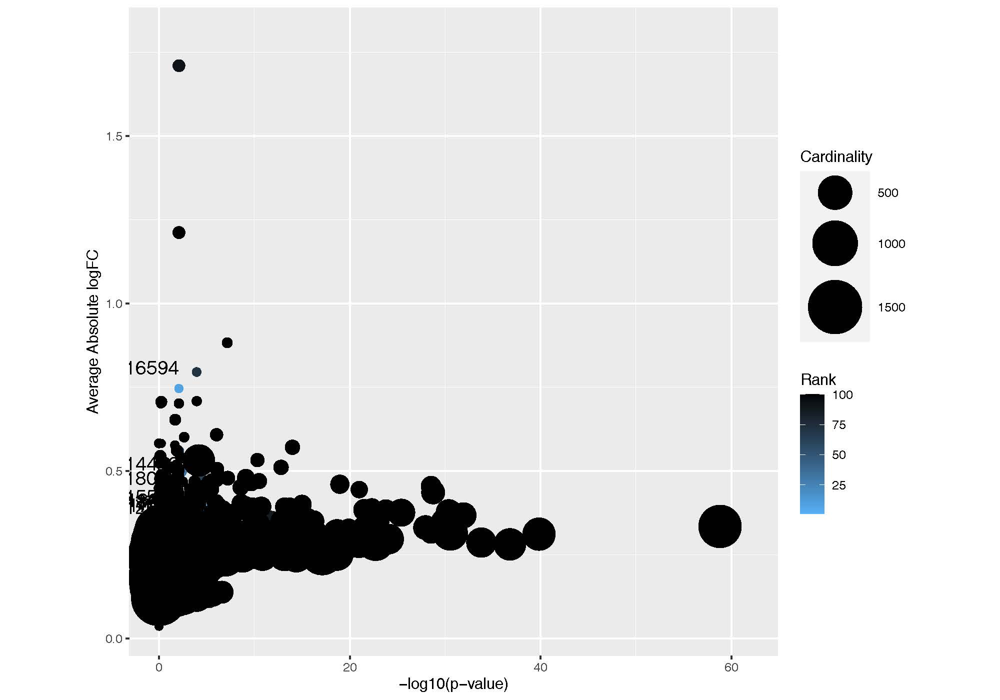
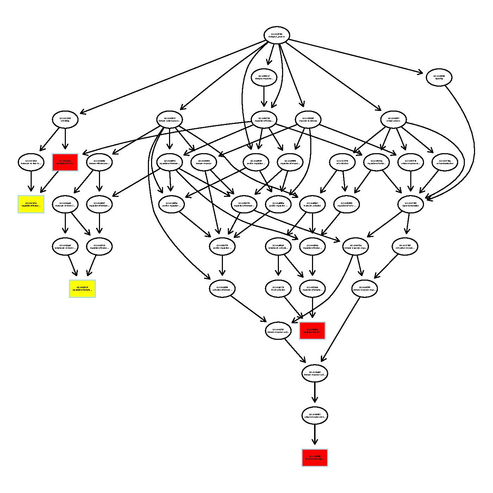
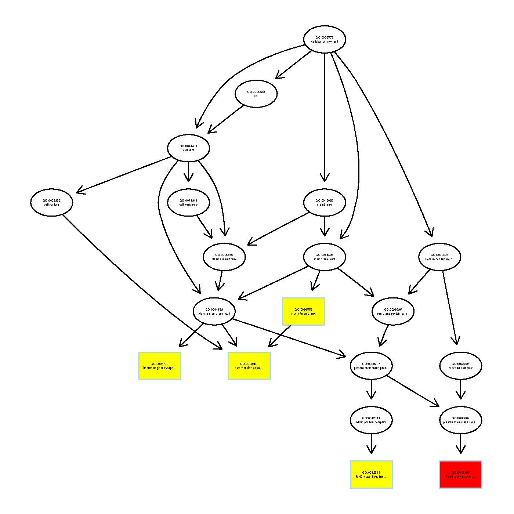
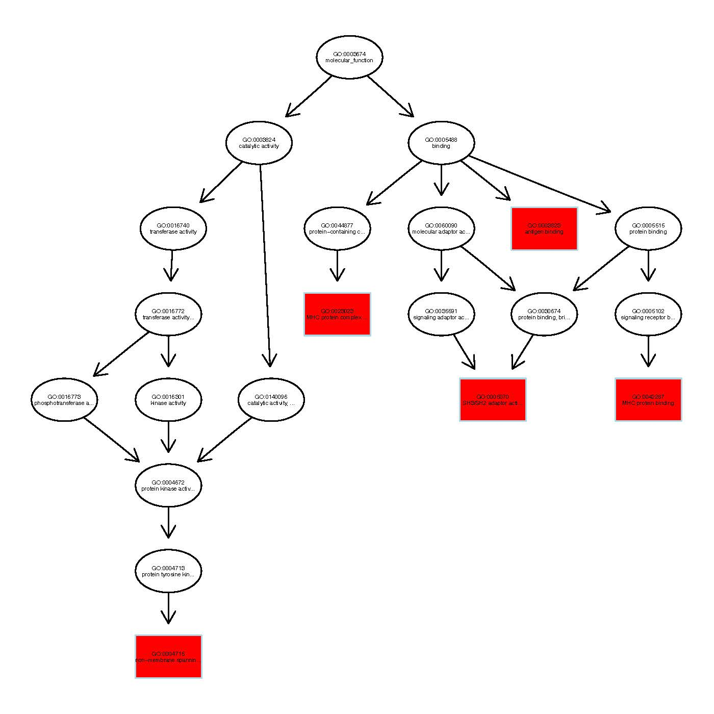
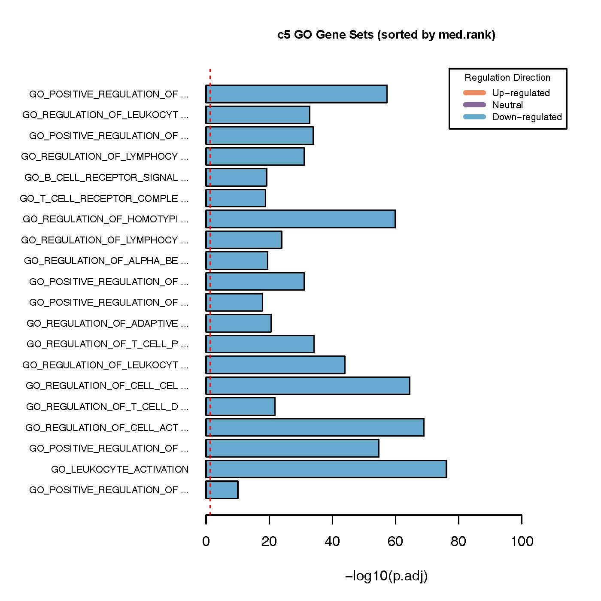
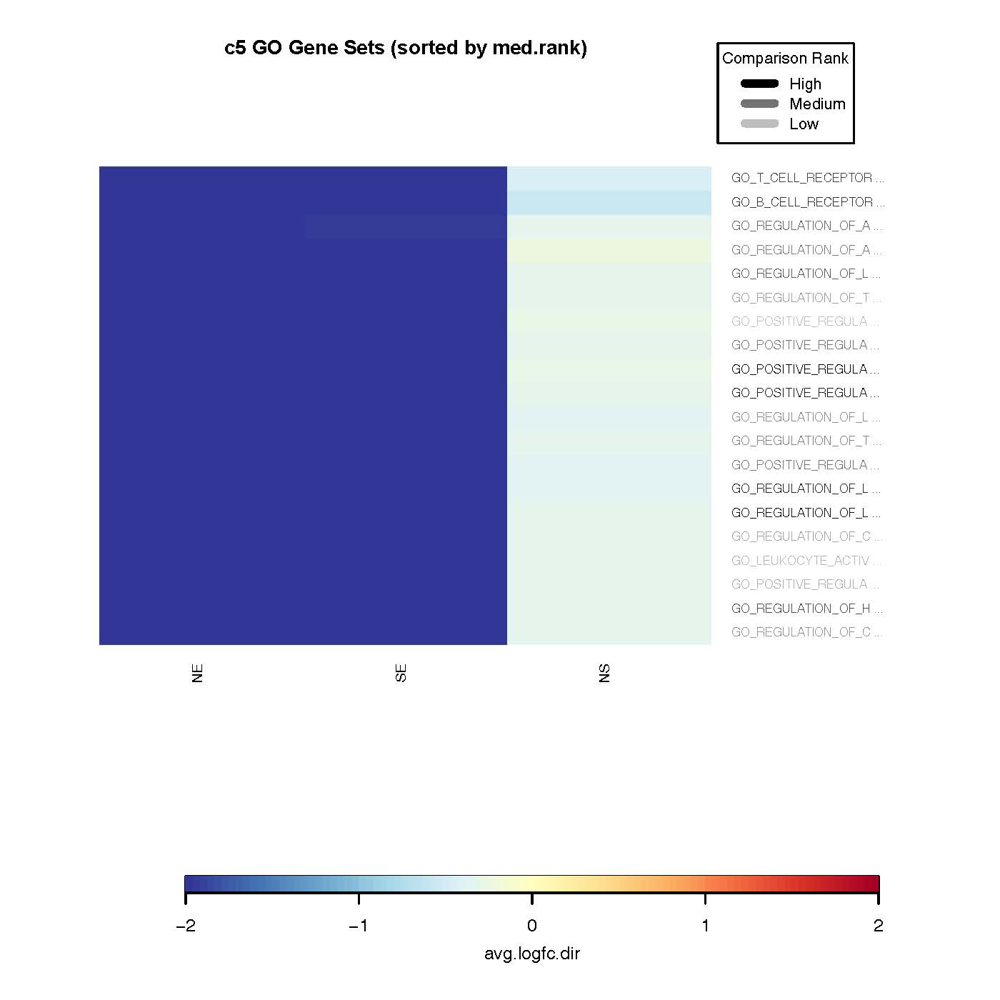

```{r setup, include=FALSE}
library(knitr)
knitr::opts_chunk$set(echo = TRUE, message = FALSE, warning = FALSE, 
                      comment = NA, prompt = TRUE, tidy = FALSE, 
                      fig.width = 7, fig.height = 7, fig_caption = TRUE,
                      cache=FALSE)
Sys.setlocale("LC_TIME", "C")
```

```{r echo=FALSE}
if(!(require(printr))) {
  install.packages(
    'printr',
    type = 'source',
    repos = c('http://yihui.name/xran', 'http://cran.rstudio.com'))
}
```

```{r echo=FALSE, message=FALSE, eval=FALSE}
# La lista de packages es mas larga de lo realmente necesario para la PEC
if(!require(BiocManager)) install.packages("BiocManager")
if(!require(airway)) BiocManager::install("airway")
if(!require(Rsamtools)) BiocManager::install("Rsamtools")
if(!require(GenomicFeatures)) BiocManager::install("GenomicFeatures")
if(!require(DESeq2)) BiocManager::install("DESeq2")
if(!require(apeglm)) BiocManager::install("apeglm")
if(!require(BiocParallel)) BiocManager::install("BiocParallel")
if(!require(genefilter)) BiocManager::install("genefilter")
if(!require(org.Hs.eg.db)) BiocManager::install("org.Hs.eg.db")
if(!require(AnnotationDbi)) BiocManager::install("AnnotationDbi")
if(!require(ReportingTools)) BiocManager::install("ReportingTools")
if(!require(RUVSeq)) BiocManager::install("RUVSeq")
if(!require(sva)) BiocManager::install("sva")
if(!require(Gviz)) BiocManager::install("Gviz")

if(!require(magrittr)) install.packages("magrittr", dep=TRUE)
if(!require(dplyr)) install.packages("dplyr", dep=TRUE)
if(!require(ggplot2)) install.packages("ggplot2", dep=TRUE)
if(!require(pheatmap)) install.packages("pheatmap", dep=TRUE)
if(!require(RColorBrewer)) install.packages("RColorBrewer", dep=TRUE)
if(!require(ggbeeswarm)) install.packages("ggbeeswarm", dep=TRUE)
if(!require(ggbeeswarm)) install.packages("EGSEA", dep=TRUE)
if(!require(ggbeeswarm)) install.packages("EGSEAdata", dep=TRUE)

#if (!requireNamespace("BiocManager", quietly = TRUE)) #install.packages("BiocManager")
#BiocManager::install("EGSEA")
# BiocManager::install("EGSEAdata")
```

```{r echo=FALSE}
library(edgeR)
```


## Resumen

Este documento presenta el proceso de análisis de datos de ultrasecuenciación obtenidos a partir de las muestras disponibles en el repositorio GTEx, que contiene datos de distintos tejidos. El estudio se centra en los datos de expresión pertenecientes a un análisis del tiroides en donde se comparan tres tipos de infiltración medidos en un total de 292 muestras pertenecientes a tres grupos: (i) Not infiltrated tissues (NIT) - 236 muestras; (ii) Small focal infiltrates (SFI) - 42 muestras; (iii) Extensive lymphoid infiltrates (ELI) - 14 muestras. El documento presenta el flujo de trabajo implantado para analizar, filtrar y normalizar los datos, realizar un estudio de expresión diferencial, anotar los resultados, buscar patrones de expresión y realizar un análisis de expresión biológica. El estudio ha sido realizado utilizando las prestaciones de la librería *edgeR* disponible en *Bioconductor*. Se ha creado un repositorio en Github (https://github.com/juan-antonio1952/ADO-PEC2.git) con toda la información necesaria para poder reproducir los resultados presentados en este documento. 

## Introducción

Los objetivos finales del presente trabajo son la realización de un estudio de expresión diferencial de genes y un análisis de expresión biológica a partir de los datos recibidos en dos archivos en formato *csv*: *targets* y *counts*. 

Estos archivos contienen datos de ultrasecuenciación de 54 tejidos distintos obtenidos a partir de las muestras disponibles en el repositorio [GTEx](https://www.nature.com/articles/ng.2653.pdf). El estudio se centra en los datos de expresión pertenecientes a un análisis del tiroides en donde se comparan tres tipos de infiltración medidos en un total de 292 muestras pertenecientes a tres grupos: (i) Not infiltrated tissues (NIT) - 236 muestras; (ii) Small focal infiltrates (SFI) - 42 muestras; (iii) Extensive lymphoid infiltrates (ELI) - 14 muestras.

El trabajo a realizar se basará en una selección de 10 muestras de cada uno de los tres grupos (NIT, SFI y ELI).

El flujo de trabajo (*workflow*) ha sido organizado en los siguientes pasos:

1. Descarga, organización y análisis de los datos.

2. Preprocesado de los datos: filtraje y normalización.

3. Identificación de genes diferencialmente expresados.

4. Anotación y enriquecimiento de genes.

5. Busca de patrones de expresión y agrupación de las muestras.

6. Análisis de significación biológica.

El trabajo ha sido realizado utilizando las prestaciones de la librería *edgeR* (Empirical Analysis of Digital Gene Expression Data in R), desarrollada por investigadores del Garvan Institute of Medical Research y The Walter and Eliza Hall Institute of Medical Research (Australia), y disponible en *Bioconductor* [[1]](https://academic.oup.com/bioinformatics/article/26/1/139/182458).

Esta librería es de manejo relativamente fácil para los objetivos de este trabajo. Por otro lado, existe una abundante bibliografía [[2]](https://rd.springer.com/chapter/10.1007%2F978-3-319-07212-8_3), [[3]](https://bioconductor.org/packages/release/bioc/manuals/edgeR/man/edgeR.pdf), [[4]](https://bioconductor.org/packages/release/bioc/vignettes/edgeR/inst/doc/edgeRUsersGuide.pdf), [[5]](http://www.nathalievialaneix.eu/doc/html/solution-edgeR-rnaseq.html), que facilita la aplicación de las prestaciones necesarias para estudios de expresión diferencial y significación biológica. Por lo que respecta al flujo de trabajo, las referencias [[6]](http://www.nathalievialaneix.eu/doc/pdf/TP-rnaseq-answers.pdf), [[7]](https://f1000research.com/articles/5-1438/v2) y [[8]](https://www.pathwaycommons.org/guide/primers/data_analysis/rna_sequencing_analysis/) han sido de gran utilidad; especialmente la primera. Otros documentos que han sido utilizados en este trabajo se encuentran en las referencias [[9]](http://www.bioconductor.org/help/course-materials/2015/useR/bioc-for-sequence-analysis.html) y [[10]](https://www.ebi.ac.uk/sites/ebi.ac.uk/files/content.ebi.ac.uk/materials/2013/131021_HTS/practical-n.delhomme.pdf).

Existen una abundante literatura sobre tecnologías de ultrasecuenciación (NGS, *Next generation Sequencing*) y los procedimientos a seguir para analizar los datos; ver referencias [[11]](https://genomebiology.biomedcentral.com/articles/10.1186/s13059-016-0881-8), [[12]](https://www.nature.com/articles/nrg.2016.49), [[13]](https://academic.oup.com/bib/article/20/6/2044/5066173), [[14]](https://doi.org/10.1201/b19532), [[15]](https://doi.org/10.1201/b17457), [[16]](https://www.springer.com/gp/book/9783319072111), [[17]](https://academic.oup.com/nar/article/40/10/4288/2411520) y [[18]](https://journals.plos.org/ploscompbiol/article?id=10.1371/journal.pcbi.1002053).

En la última sección de este documento se han añadido los enlaces de otras páginas web que han sido consultadas durante la realización del presente estudio.

## Entrada y preparación de datos 

Se leen los dos archivos cuyos datos se han de utilizar en este trabajo: *targets* y *counts*; los dos en formato ``csv``.

* Archivo *targets*

Una vez descargado hay que seleccionar de forma aleatoria 10 muestras de cada uno de los tres grupos existentes (ELI, NIT, SFI); estas muestras serán las que servirán para la realización del estudio. El procedimiento a seguir para conseguir esto es evidente: (i) se lee/descarga el archivo; (ii) se realiza una selección aleatoria de 10 muestras para cada grupo; (iii) finalmente, para facilitar el estudio, se renombran las muestras utilizando las referencias abreviadas, disponibles en el mismo archivo.

NOTAS

* En la información disponible en el archivo ``targets`` aparecen muestras obtenidas mediante ultrasecuenciación y otras técnicas. Se considera que ambas son válidas y se utilizan todas las seleccionadas.

* El último paso, renombrar las muestras con la referencia abreviada, no sería necesario si la selección se realizara a partir de las referencias abreviadas y no de las referencias completas.  

```{r echo=FALSE}
targets <- read.csv("targets.csv", row.names = 1)
cat("Archivo targets", "\n")
class(targets)
str(targets)
#head(targets[1:10,])
```


```{r echo=FALSE}
set.seed(12345)
GNIT <- which(targets$Group=="NIT")
NITsamples <- targets[sample(GNIT, 10), 2]
GSFI <- which(targets$Group=="SFI")
SFIsamples <- targets[sample(GSFI, 10), 2]
GELI <- which(targets$Group=="ELI")
ELIsamples <- targets[sample(GELI, 10), 2]
```

```{r echo=FALSE}
(samplest <- c(NITsamples, SFIsamples, ELIsamples))
targets$ShortName[c(as.matrix(samplest))]
```

* Archivo *counts*

Se procede como con el archivo *targets*. Una vez descargado el nuevo archivo se seleccionan las mismas muestras que en *targets*.

```{r echo=FALSE}
tabla <- read.csv("counts.csv", sep=";", header=TRUE)
tabla <- as.data.frame(tabla)
rown <- tabla[,1]    # Se copian los nombres de la primera columna
tabla <- tabla[,-1]  # Se quita la primera columna
rownames(tabla) <- rown  # Se nombran las filas
```


```{r echo=FALSE}
counts <- as.matrix(tabla[, samplest])
colnames(counts)
colnames(counts) <- targets$ShortName[c(as.matrix(samplest))]
rownames(counts) <- rown
```

```{r echo=FALSE}
cat("Archivo counts", "\n")
dim(counts)
counts[1:5,1:5]
```

Se observa que el archivo final tiene datos de 30 muestras correspondientes a 56202 transcritos.

Para completar el archivo de trabajo, se crea un tercer objeto; *genes*, con los nombres de las filas del archivo original. Inicialmente, es un data frame con una sola columna que se nombra *RefENSMBL*, y en la que los nombres de los genes se han reducido, excluyendo la versión. Se le añade una segunda columna con el identificador *Entrez* de los genes.

```{r echo=FALSE}
genes <- as.data.frame(substring(c(rownames(counts)), 1, 15))
colnames(genes) <- "RefENSMBL"
head(genes)
library(org.Hs.eg.db)
symbols2 <- as.character(genes[,1])
entrezIDs <- mapIds(org.Hs.eg.db, symbols2, 'ENTREZID', 'ENSEMBL')
genes <- as.data.frame(cbind(genes,entrezIDs))
head(genes)
counts2 <- cbind(counts, genes)
```

Se observa que hay un elevado número de valores perdidos, NAs. Se cuenta el número con el siguiente código.

```{r echo=FALSE}
na_count <-sapply(genes[,2], function(y) sum(length(which(is.na(y)))))
lNAs <- length(which(na_count==1))
cat(paste("Número de NAs en código ENTREZ =",lNAs,"\n"))
```

La librería *edgeR* trabaja con una tabla de las lecturas que hay en el objeto *counts*, con filas correspondientes a los genes y columnas correspondientes a las muestras. Esta librería almacena los datos en un simple objeto de clase ``DGEList`` basado en listas.

La última tarea en esta primera etapa consiste en convertir los datos descargados en un objeto de clase `DGEList`, quitar las filas de los genes con todas las entradas a 0 y renombrar los grupos del objeto creado según los acrónimos asignados a los grupos de las muestras de tejidos analizadas (NIT, SFI, ELI). La estructura inicial tiene tres objetos: 

```{r echo=FALSE}
countsFull <- DGEList(counts=counts2[,1:30], genes=counts2[,c(31,32)], 
                      remove.zeros = TRUE)
names(countsFull)
```

```{r echo=FALSE}
cat("Archivo - Clase DGEList", "\n")
names(countsFull)
# summary(countsFull)
```

El archivo tiene tres objetos, ``counts``, ``samples`` y ``genes``. Para la mayoría de tareas, el tercero no es necesario. Se muestra el contenido de los tres. En el objeto ``samples`` se renombran la variable grupo según el grupo de muestras (NIT, SIF, ELI) y se presenta una selección que cubre los tres grupos.

```{r echo=FALSE}
cat("Objeto counts","\n")
dim(countsFull$counts)
countsFull$counts[1:5,1:3]
```


```{r echo=FALSE}
cat("Objeto samples","\n")
dim(countsFull$samples)
cat("Antes de renombrar los grupos","\n")
countsFull$samples[c(1:3,11:13,21:23),]
cat("\n")
cat("Después de renombrar los grupos","\n")
countsFull$samples$group <- c(replicate(10,"NIT"),
                              replicate(10,"SIF"),
                              replicate(10,"ELI"))
countsFull$samples[c(1:3,11:13,21:23),]
```

```{r echo=FALSE}
cat("Objeto genes","\n")
countsFull$genes[1:5,]
```


El archivo final que se analizará a continuación tiene 46387 tránscritos provenientes de las 30 muestras seleccionadas. 


## Análisis de los datos

Los valores de las cuentas (*reads*) de un estudio de ultrasecuenciación están muy sesgadas. Para analizar y visualizar datos, es muy útil trabajar con una versión de datos transformados en la que se utiliza el logaritmo de base 2

$$y = \textrm{log}_2(K+k)$$
donde $K$ es el número de las cuentas y $k$ una constante positiva (aquí se usa $0.5$), que evitará problemas cuando el valor de las cuentas sea 0.

Se presentan algunos resultados después de realizar la transformación logarítmica.

```{r echo=FALSE}
cat("Datos transformados", "\n")
cat("","\n")
pseudoCounts <- log2(countsFull$counts + 0.5)
head(pseudoCounts)[1:5,1:5]
```

A continuación, se presentan algunos resultados gráficos; como paso previo, se escogen los colores que serán utilizados en las siguientes figuras, teniendo en cuenta los factores (NIT, SFI, ELI) de las muestras a analizar.

```{r echo=FALSE}
library(RColorBrewer)
labels_counts <- as.factor(countsFull$samples$group)
levels_counts <- levels(labels_counts)
ncolors <- length(levels_counts)
colors <- brewer.pal(ncolors, "Set2")
colors_counts <- colors[unname(labels_counts)]
```


La Figura 1 compara la distribución de una muestra antes y después de transformar los datos. Se puede comprobar fácilmente el efecto de la transformación logarítmica por el cambio en la distribución de las frecuencias que aparecen en cada versión.

```{r fig.cap='Figura 1. Histogramas - Muestra 12.', fig.width=10, echo=FALSE}
par(mfrow=c(1,2))
hist(countsFull$counts[, 12], 
     main = "Before transformation", xlab = "counts")
hist(pseudoCounts[ ,12], 
     main = "After transformation", xlab = "counts")
```

Un diagrama de cajas puede ser muy útil para visualizar la distribución de valores entre muestras, contrastar la distribución de valores de expresión a nivel de genes en distintas muestras, o comprobar el efecto del filtrado. La Figura 2 muestra los diagramas de cajas para el caso en estudio antes de filtrar. Se pueden observar las diferencias entre las muestras de cada grupo y entre las muestras de diferentes grupos; por otro lado, es evidente el efecto de la transformación logarítmica que reduce de forma significativa las diferencias.

```{r fig.cap='Figura 2. Diagramas de cajas - Muestras transformadas.', fig.height=10, fig.width=12, echo=FALSE}
par(mar=c(10,4,2,4))
boxplot(pseudoCounts, col=colors_counts, las=2, 
        cex.names=0.2, cex.lab=2)
```

Un gráfico tipo MA presenta los valores M (el logaritmo de la relación entre las cuentas de cada gen entre dos muestras) frente a valores A (el nivel medio de cuentas para cada gen entre dos muestras). Este tipo de gráfico se utiliza para presentar la reproductibilidad entre muestras de un experimento y permite deducir si es necesaria la normalización de los datos originales: en un gráfico MA los genes con una expresión similar en dos muestras se sitúan en la recta horizontal, $y$ = 0. La Figura 3 muestra este tipo de gráfico para las dos primeras muestras del estudio. 

```{r fig.cap='Figura 3. Gráfico MA - Muestras 1-2.', echo=FALSE}
limma::plotMA(pseudoCounts[ ,1:2], xlab = "M", ylab = "A", 
              main = "Gráfico MA - Muestras 1 y 2")
abline(h = 0, col = "red")
```

El objetivo de una escalado multidimensional (MDS en inglés) es presentar un patrón de similaridad entre un conjunto de objetos. En general, la similaridad entre cada par de muestras se mide con la distancia euclídea entre las cuentas de los genes. La Figura 4 muestra el escalado multidimensional de los datos transformados. Esta figura ha sido obtenida con la opción ``geneselection = "common"`` que escoge los genes que presentan una máxima desviación entre muestras. El resultado con la opción ``geneselection = "common"`` muestra una clara división entre dos conglomerados en cada uno de los cuales se encuentran muestras de los tres grupos. 

```{r fig.cap='Figura 4. Escalado multidimensional.', echo=FALSE}
plotMDS(pseudoCounts, pch=c(21:23), bg = colors, cex=1.5, gene.selection = "common")
legend("topright", legend=levels(targets$Group), 
       pch=c(21:23), pt.bg=brewer.pal(ncolors, "Set2"))
```

Dendrogramas y mapas de colores son dos opciones gráficas que permiten visualizar de forma relativamente rápida la división de muestras entre grupos o conglomerados utilizando las distancias entre muestras. Un mapa de colores es un gráfico bidimensional en el que los datos se presentan con un determinado color que tiene en cuenta su situación en la matriz de distancias: las filas y columnas se disponen de acuerdo con una organización jerárquica en la que filas y columnas similares se colocan una cerca de la otra. Las Figuras 5 and 6 muestran el dendrograma y el mapa de color que resultan con los datos transformados.

```{r fig.cap='Figura 5. Dendrograma de las muestras.', fig.height=10, fig.width=12, echo=FALSE}
sampleDists <- as.matrix(dist(t(pseudoCounts)))
# dim(sampleDists)
cs  <- hclust(dist(t(pseudoCounts)), method = "ward.D2")
dmd <- as.dendrogram(cs)
# par(mar=c(14,4,2,4))
plot(dmd, ylim=c(0,700))
# abline(h=410, col="red")
```

```{r fig.cap='Figura 6. Mapa de color de las muestras.',fig.height=8, fig.width=12, echo=FALSE}
par(mar=c(18,4,2,4))
heatmap(sampleDists)
```

Tanto el dendrograma como el mapa de colores presentan la organización de las muestras según un determinado criterio que tiene en cuenta las distancias. Los resultados no son iguales: se puede comprobar que el dendrograma de la Figura 5 no es el mismo que los que aparecen en la Figura 6. En ambos casos se observa que algunas distancias entre muestras de diferentes grupos son más cortas que las que hay entre las muestras de un mismo grupo. Supóngase, por ejemplo, que el dendrograma de la Figura 5 se divide en 3 conglomerados, aunque la mayoría de muestras del conglomerado de la derecha son de tipo NIT y SFI, también hay alguna de tipo ELI.

## Filtrado y normalización de los datos

### Filtrado

Los genes con cuentas muy bajas son poco útiles para un estudio de expresión diferencial. Un primer filtrado se puede realizar teniendo en cuenta este hecho: se eliminan los genes que no alcanzan un mínimo nivel. Aunque el valor umbral lo fija el usuario, se suele aceptar que no son necesarios para el estudio los genes que no tengan más de 5-10 cuentas por millón. En general, el filtrado se suele realizar usando el concepto CPM (count-per-millon).

La librería *edgeR* dispone de varias opciones para realizar un filtrado. Una de estas opciones es ``filterByExpr``, que mantiene la filas (genes) con un mínimo número de genes y realiza el filtrado independientemente del grupo al que pertenece la muestra. Aquí se aplica con las opciones por defecto.

```{r fig.height=10, fig.width=12, echo=FALSE}
filtered.group <- filterByExpr(countsFull)
filtered.group <- countsFull[filtered.group, keep.lib.sizes=FALSE]
```

```{r echo=FALSE, eval=FALSE}
cat("Antes del filtrado","\n")
countsFull$samples[1:5,]
cat("\n")
cat("Después del filtrado","\n")
# filtered.group$counts[1:5,1:5]
filtered.group$samples[1:5,]
```


```{r echo=FALSE}
cat("Dimensiones antes del filtrado", "\n")
dim(countsFull)
cat("\n")
cat("Dimensiones después del filtrado", "\n")
dim(filtered.group)
```

Si se comparan los valores que aparecen en las dos tablas anteriores, se puede observar que las diferencias entre las muestras (antes y después del filtrado) no son muy elevadas. Sin embargo, el tamaño de los datos después del filtrado se reduce a 22185 tránscritos, frente a 46387 que había después de eliminar todos los genes con cuentas nulas.

### Normalización

El proceso de normalización se aplica para identificar y eliminar diferencias técnicas entre muestras, y asegurar que los sesgos técnicos tienen un mínimo impacto sobre los resultados. Se han propuesto varios métodos de normalización, y aunque no existe consenso sobre cuál es el mejor, todos se basan en el mismo principio: multiplicar las cuentas de una muestra por el mismo factor (diferente entre muestras) que forma que el resultado final sea un número comparable de cuentas en todas las muestras.

La librería *edgeR* dispone de la función ``calcNormFactors`` que calcula los factores de escalado que minimizan las diferencias entre muestras. La función se puede aplicar utilizando distintos métodos; el aplicado aquí el ``TMM`` (*trimmed mean of M-values*)   

```{r echo=FALSE}
filtered.group <- calcNormFactors(filtered.group, method="TMM")
filtered.group$samples[1:5,]
```


```{r echo=FALSE, eval=FALSE}
class(filtered.group)
filtered.group$counts[1:5,1:5]
filtered.group$samples[1:5,]
filtered.group$genes[1:5,]
```


Se presentan algunos resultados gráficos con datos filtrados y normalizados. 

La Figura 7 muestra el diagrama de cajas que resulta una vez los datos han sido filtrados y después de aplicar la transformación logarítmica comentada en la sección anterior. Se puede comprobar que hay diferencias tanto en la forma como en los valores del nuevo gráfico con respecto al anterior mostrado en la Figura 2.

```{r fig.cap='Figura 7. Diagramas de cajas de los datos filtrados.', echo=FALSE}
filter.pseudoCounts <- log2(filtered.group$counts + 1)
par(mar=c(10,4,2,4))
boxplot(filter.pseudoCounts, col=colors_counts, las = 2, cex.names = 1)
```

Cuando se ajusta un modelo binomial, la variabilidad dentro de un grupo se representa con la dispersión. El hecho de tener datos de varias muestras con los mismos genes puede ayudar en la inferencia de cada gen en particular; por ejemplo, asumiendo que la dispersión es la misma en todos los genes. Una extensión de esta hipótesis sería asumir una tendencia media en la varianza que también se podría suponer la misma para todos los genes. Sin embargo, los niveles de expresión entre genes no son iguales por lo que se hace necesario suponer una dispersión específica para cada gen.

La Figura 8 presenta un gráfico tipo BCV (*genewise biological coefficient variation*) de los datos filtrados. El valor BCV es la raíz cuadrada de la dispersión binomial negativa. Este tipo de gráfico presenta la variación del BCV frente a la abundancia de genes (expresada en el logaritmo de las cuentas por millón), y presenta una estimación de la dispersión de cada gen con la relación de dispersión media. Para poder obtener el gráfico tipo BCV es necesario aplicar la función ``estimateCommonDisp``, que maximiza la verosimilitud común condicional binomial para estimar la dispersión en todos los genes, y después la función ``estimateTagwiseDisp``, que estima los valores de dispersión mediante un método empírico de Bayes basado en una verosimilitud máxima condicional ponderada.


```{r fig.cap='Figura 8. Gráfico BCV de los datos filtrados y normalizados.', echo=FALSE}
filtered.group$samples$group <- as.factor(filtered.group$samples$group)
filtered.group2 <- estimateCommonDisp(filtered.group, verbose=TRUE)
filtered.group2 <- estimateTagwiseDisp(filtered.group2)
class(filtered.group2)
plotBCV(filtered.group2)
```


El filtrado solo afecta al objeto ``counts``, mientras que la normalización afecta solo al objeto ``samples``; puesto que la normalización se realiza con los datos ya filtrados, el gráfico BCV presenta los dos efectos.


## Expresión diferencial

Las prestaciones de ``edgeR`` permiten realizar la identificación de genes diferencialmente expresados de varias formas. En este trabajo se aplicarán tres. 

### Identificación de genes diferencialmente expresados

Obtener los genes expresados diferencialmente es inmediato una vez que se han ajustado los modelos binomiales de cada gen y se han estimado las dispersiones. La librería ``edgeR`` permite contrastar dos condiciones con la función ``exactTest``, que calcula, entre otros, los valores $p$ o las diferencias entre los valores medias de dos grupos de cuentas distribuidas binomialmente.

A continuación, se presentan los resultados de las tres comparaciones (NIT-ELI, SIF-NIT y ELI-SIF). Para visualizar los resultados se dispone de varias opciones: gráficos MA, gráficos tipo volcán, o dendrogramas. 

Un gráfico MA presenta una visión general de la comparación entre dos grupos. Cada gen se presenta con un punto cuyas coordenadas son el promedio del logaritmo de cuentas por millón (CPM) y el logaritmo base 2 del FC (fold change). Los genes con un valor $p$ por debajo de un determinado umbral (threshold, cutoff) se suelen colorear: la función ``smear`` selecciona aquellos que tienen una concentración estimada mínima en uno de los grupos, especialmente los que tienen una cuenta igual a cero. Las Figuras 9, 10 y 11 muestran los gráficos MA que resultan de las tres comparaciones (NIT-ELI, SIF-NIT, ELI-SIF). Los gráficos se han generado con la función ``plotSmear``.


```{r echo=FALSE}
et12 <- exactTest(filtered.group2, pair=c(1,2)) # compare groups 1 and 2
de1 <- decideTestsDGE(et12, adjust.method="BH", p.value=0.05)
cat("Comparación NIT-ELI","\n")
summary(de1)
```

```{r fig.cap='Figura 9. Gráfico MA - Comparación NIT-ELI.', echo=FALSE}
cat("\n")
de1tags12 <- rownames(filtered.group2)[as.logical(de1)] 
plotSmear(et12, de.tags=de1tags12, main="Comparison NIT-ELI")
abline(h = c(-2, 2), col = "blue")
```


```{r echo=FALSE}
et23 <- exactTest(filtered.group2, pair=c(2,3)) # compare groups 2 and 3
de2 <- decideTestsDGE(et23, adjust.method="BH", p.value=0.05)
cat("Comparación SIF-NIT","\n")
summary(de2)
```

```{r fig.cap='Figura 10. Gráfico MA - Comparación SIF-NIT.', echo=FALSE}
cat("\n")
de1tags23 <- rownames(filtered.group2)[as.logical(de1)] 
plotSmear(et23, de.tags=de1tags12, main="Comparison SIF-NIT")
abline(h = c(-2, 2), col = "blue")
```


```{r echo=FALSE}
et31 <- exactTest(filtered.group2, pair=c(3,1)) # compare groups 3 and 1
de3 <- decideTestsDGE(et31, adjust.method="BH", p.value=0.05)
cat("Comparación ELI-SIF","\n")
summary(de3)
```


```{r fig.cap='Figura 11. Gráfico MA - Comparación ELI-SIF.', echo=FALSE}
cat("\n")
de1tags31 <- rownames(filtered.group2)[as.logical(de1)] 
plotSmear(et31, de.tags=de1tags12, main="Comparison ELI-SIF")
abline(h = c(-2, 2), col = "blue")
```


El resultado de una comparación entre dos grupos se puede obtener con la opción ``topTags`` y produce la siguiente información en la que los genes van ordenados de menor a mayor valor $p$:

```{r echo=FALSE}
topTags(et12, n=5)
```

El significado de las columnas es el siguiente:

* logFC: the logarithm (to basis 2) of the fold change;

* logCPM: the average log2 counts-per-million (CPM) for each tag;

* PValue: p value for the statistical significance of this change;

* FDR: p value adjusted for multiple testing with the Benjamini-Hochberg procedure, which controls false discovery rate (FDR).

Un *volcano plot* es una manera efectiva de presentar un test estadístico. Se trata de un gráfico de dispersión con el $\textrm{log2}$ de la diferencia de medias (el numerador del test $t$ o *fold change*) en el eje de las x y los valores $p$ en el eje de las y. El gráfico termina adoptando la forma de volcan si se transforman los p-valores aplicando la función $\textrm{−log10}(p)$. Para destacar genes, se añaden dos rectas verticales y una recta horizontal. Teniendo en cuenta lo que se presenta en cada eje, si se quieren destacar los genes con un valor $p$ por debajo de 0.01 se coloca la recta horizontal en 2: los genes destacados son lo que quedan por encima de la recta. El $\textrm{log2}$ del FC (*fold change*) se usa para mostrar los genes equidistantes del centro que quedan arriba (*up*) y abajo (*down*).

Las Figuras 12, 13 y 14 muestran los gráficos resultantes para las tres comparaciones en las que se destacan (en color rojo) los genes con un valor $p$ inferior a 0.05 y un valor absoluto del logaritmo base 2 del *fold change* superior a 2.

```{r echo=FALSE}
lfc  <- 2
pval <- 0.05
```


```{r fig.cap='Figura 12. Volcano plot - Comparación NIT-ELI.', echo=FALSE}
par(mar = c(4, 4, 4, 4))
taget12 <- topTags(et12, n=22185)
taget12 <- taget12[,-c(1:2)]
tab12 <- data.frame(logFC=taget12$table[, 1], 
                    negLogPval=-log10(taget12$table[, 3]))
plot(tab12$logFC, tab12$negLogPval, pch = 16, cex = 0.6, 
     xlab = expression(log[2]~fold~change), 
     ylab = expression(-log[10]~pvalue))
## Selecting interest genes
signGenes = (abs(tab12$logFC) > lfc & tab12$negLogPval > -log10(pval))
## Identifying the selected genes
points(tab12[signGenes, ], pch = 16, cex = 0.8, col = "red")
abline(h = -log10(pval), col = "green3", lty = 2)
abline(v = c(-lfc, lfc), col = "blue", lty = 2)
mtext(paste("pval =", pval), side = 4, at = -log10(pval), 
      cex = 0.8, line = 0.5, las = 1)
mtext(c(paste("-", lfc, "fold"), paste("+", lfc, "fold")), 
      side = 3, at = c(-lfc, lfc), cex = 0.8, line = 0.5)
```

```{r fig.cap='Figura 13. Volcano plot - Comparación SIF-NIT.', echo=FALSE}
par(mar = c(4, 4, 4, 4))
taget23 <- topTags(et23, n=22185)
taget23 <- taget23[,-c(1:2)]
tab23 <- data.frame(logFC=taget23$table[, 1], 
                    negLogPval=-log10(taget23$table[, 3]))
plot(tab23, pch = 16, cex = 0.6, 
     xlab = expression(log[2]~fold~change), 
     ylab = expression(-log[10]~pvalue))
signGenes = (abs(tab23$logFC)>lfc & tab23$negLogPval>-log10(pval))
points(tab23[signGenes, ], pch = 16, cex = 0.8, col = "red")
abline(h = -log10(pval), col = "green3", lty = 2)
abline(v = c(-lfc, lfc), col = "blue", lty = 2)
mtext(paste("pval =", pval), side = 4, at = -log10(pval), 
      cex = 0.8, line = 0.5, las = 1)
mtext(c(paste("-", lfc, "fold"), paste("+", lfc, "fold")), 
      side = 3, at = c(-lfc, lfc), cex = 0.8, line = 0.5)
```


```{r fig.cap='Figura 14. Volcano plot - Comparación ELI-SIF.', echo=FALSE}
par(mar = c(4, 4, 4, 4))
taget31 <- topTags(et31, n=22185)
taget31 <- taget31[,-c(1:2)]
tab31 <- data.frame(logFC=taget31$table[, 1], 
                    negLogPval=-log10(taget31$table[, 3]))
plot(tab31, pch = 16, cex = 0.6, 
     xlab = expression(log[2]~fold~change), 
     ylab = expression(-log[10]~pvalue))
signGenes = (abs(tab31$logFC)>lfc & tab31$negLogPval>-log10(pval))
points(tab31[signGenes, ], pch = 16, cex = 0.8, col = "red")
abline(h = -log10(pval), col = "green3", lty = 2)
abline(v = c(-lfc, lfc), col = "blue", lty = 2)
mtext(paste("pval =", pval), side = 4, at = -log10(pval), 
      cex = 0.8, line = 0.5, las = 1)
mtext(c(paste("-", lfc, "fold"), paste("+", lfc, "fold")), 
      side = 3, at = c(-lfc, lfc), cex = 0.8, line = 0.5)
```


### Aplicación de un modelo lineal generalizado (GLM)

El primer paso en la aplicación de esta opción será crear la matriz de diseño para poder obtener toda la información experimental deseada. En el presente estudio se trata de comparar los tres tipos de infiltración medidos: NIT, SFI, y ELI. La matriz se puede generar teniendo en cuenta los tres factores y utilizando la función ``model.matrix``.


```{r echo=FALSE}
G <- as.factor(countsFull$samples$group)
design.matrix  <- model.matrix(~ 0+G)
labels <- colnames(countsFull$counts)
rownames(design.matrix) <- labels
cat("Matriz de diseño","\n","\n")
design.matrix
```

El ajuste de un modelo lineal con *edgeR* requiere de varios pasos: ajusta la dispersión común, la tendencia (*trend*) de la dispersión, y la dispersión particular de cada muestra (*tagwise dispersion*). La dispersión de un gen es utilizada para representar la varianza en los valores de las cuentas y se mide con el cuadrado del coeficiente de variación biológica.

Para aplicar este procedimiento con la librería ``edgeR`` se utiliza la función ``estimateDisp`` basada en una estrategia empírica de verosimilitud ponderada.


```{r echo=FALSE}
group1 <- estimateGLMCommonDisp(filtered.group2, design.matrix)
```


La información creada en el nuevo objeto está organizada de la siguiente forma:

```{r echo=FALSE}
cat("Objetos creados con la función estimateGLMCommonDisp","\n","\n")
names(group1)
```

Se presentan 

* la dispersión común

```{r echo=FALSE}
cat("Dispersión común", "\n","\n")
group1$common.dispersion
```

* los valores mínimo y máximo de la dispersión

```{r echo=FALSE}
cat("Valores mínimo y máximo de la dispersión común", "\n","\n")
summary(group1$tagwise.dispersion)
```

El valor de dispersión común es 0.23, mientras que los valores mínimo y máximo son, respectivamente, 0.03 y 4.20.

A continuación, se aplican las funciones ``estimateGLMTrendedDisp`` (con las opciones por defecto) y  ``estimateGLMTagwiseDisp``.

```{r echo=FALSE}
group1 <- estimateGLMTrendedDisp(group1, design.matrix)
group1 <- estimateGLMTagwiseDisp(group1, design.matrix)
```

El resultado del proceso completo se resume en la Figura 15 que presenta un gráfico BCV. Si se compara con el de la Figura 8 se puede observar que ahora aparece la tendencia de la variación. En general, la tendencia de la dispersión es la de decrecer con un incremento de las cuentas en los genes.

```{r fig.cap='Figura 15. Gráfico BCV - modelo lineal generalizado (GLM).', echo=FALSE}
plotBCV(group1)
```

Finalmente, antes de proceder a realizar los contrastes se obtiene un modelo lineal general con la función ``glmFit``.

```{r echo=FALSE}
fit <- glmFit(group1, design.matrix)
```

La lista de objetos creados con este modelo es la siguiente:

```{r echo=FALSE}
cat("Objetos del modelo lineal generalizado (GLM)", "\n","\n")
names(fit)
```

Se realizan los contrastes utilizando la función ``glmLRT``. El resultado es clasificado (up, down, not significant) con la función ``decideTestsDGE``. Por otro lado, este resultado se puede presentar de forma gráfica utilizando la función ``plotSmear``.

Se presentan los resultados de las tres comparaciones y el gráfico correspondiente a la primera comparación.

```{r echo=FALSE}
dgeLRTtest1 <- glmLRT(fit, contrast=c(-1,1,0))
topTags(dgeLRTtest1, n=5)
de1 <- decideTestsDGE(dgeLRTtest1, adjust.method="BH", p.value = 0.05)
summary(de1)
de2tags1 <- rownames(group1)[as.logical(de1)]
```


```{r fig.cap='Figura 16. Gráfico MA - Comparación NIT-ELI.', echo=FALSE}
plotSmear(dgeLRTtest1, de.tags=de2tags1, main="Comparación NIT-ELI")
abline(h = c(-2, 2), col = "blue")
```


```{r echo=FALSE}
dgeLRTtest2 <- glmLRT(fit, contrast=c(0,-1,1))
topTags(dgeLRTtest2, n=5)
de2 <- decideTestsDGE(dgeLRTtest2, adjust.method="BH", p.value = 0.05)
summary(de2)
de2tags2 <- rownames(group1)[as.logical(de2)]
```


```{r echo=FALSE}
dgeLRTtest3 <- glmLRT(fit, contrast=c(1,0,-1))
topTags(dgeLRTtest3, n=5)
de3 <- decideTestsDGE(dgeLRTtest3, adjust.method="BH", p.value = 0.05)
summary(de3)
de2tags3 <- rownames(group1)[as.logical(de3)]
```


Aunque los resultados no son los mismos que se obtuvieron con el método anterior, las cantidades son muy similares para los tres contrastes.

### Aplicación de la matriz de contrastes

Si se desea que las comparaciones sean las mismas que se han realizado con los dos métodos anteriores, la matriz de contrastes debería ser la siguiente:

```{r echo=FALSE}
contrast_levels <- colnames(design.matrix)
contrast.matrix <- makeContrasts(NE = GNIT - GELI,
                                 NS = GNIT - GSIF,
                                 SE = GSIF - GELI,
                                 levels = contrast_levels)
cat("Matriz de contrastes","\n","\n")
contrast.matrix
```

El procedimiento implantado aquí empieza con un filtrado mediante la función ``filterByExpr``, y continua con la aplicación de la función ``voom``. Esta función cálcula el logaritmo base 2 de las cuentas por millon (logCPM), estimata la relación media-varianza y usa estos resultados para calcular los pesos (*weigths*) adecuados. Los datos obtenidos se ajustan mediante un modelo lineal con la librería ``limma`` [[19]](https://f1000research.com/articles/5-1408/v3), [[20]](https://www.bioconductor.org/packages/release/bioc/vignettes/limma/inst/doc/usersguide.pdf), [[21]](https://bioconductor.org/packages/release/bioc/manuals/limma/man/limma.pdf): aplicación de la función ``lmFit`` seguida de la aplicación de ``eBayes`` con la matriz de contrastes definida anteriormente. 

Inicialmente, se presenta el resultado obtenido con la función ``voom``; al final, el obtenido con la función ``eBAyes``. 


```{r fig.cap='Figura 17. Resultado función voom.', echo=FALSE}
keep <- filterByExpr(countsFull, design.matrix)
length(which(keep==TRUE))
v <- voom(countsFull[keep,], design.matrix, plot=TRUE)
id=rownames(v)
```


```{r echo=FALSE}
vfitx <- limma::lmFit(v, design.matrix)
vfitx <- contrasts.fit(vfitx, contrasts=contrast.matrix)
efitx <- eBayes(vfitx)
# head(efitx)
summary(decideTests(efitx))
```

```{r fig.cap='Figura 18. Modelo final - Tendencia media-varianza.', echo=FALSE}
plotSA(efitx) #main="Final model: Mean-variance trend")
```

El resultado final con esta opción es el siguiente:

```{r echo=FALSE}
tfitx <- treat(vfitx, lfc=0.05)
dtx <- decideTests(tfitx)
summary(dtx)
```

```{r echo=FALSE}
cat("\n")
cat("Contraste NIT-ELI","\n")
head(topTreat(tfitx, coef=1, n=Inf))
cat("\n")
cat("Contraste NIT-SIF","\n")
head(topTreat(tfitx, coef=2, n=Inf))
cat("\n")
cat("Contraste SIF-ELI","\n")
head(topTreat(tfitx, coef=3, n=Inf))
```

Se puede comprobar que en el segundo contraste todos los genes tienen su valor $p$ en 1.

La Figura 19 muestra un gráfico tipo MD (log-FCs vs average log-CPM) del contraste NIT-ELI a partir de los resultados del último modelo lineal.  

```{r fig.cap='Figura 19. Modelo MD - Contraste NIT-ELI.', echo=FALSE}
plotMD(tfitx, column=1, status=dtx[,1], main="Contraste NIT-ELI")
```


Los resultados obtenidos con las comparaciones realizadas se pueden resumir con un diagrama de Venn. 

La Figura 20 muestra el número de genes diferencialmente expresados que se ha obtenido en cada comparación y los comunes a cada grupo, con los dos primeros métodos.

```{r fig.height=6, fig.width=6, fig.cap='Figura 20. Diagrama de Venn con las tres comparaciones - Métodos 1 y 2.', echo=FALSE}
library(VennDiagram)
#par(mar=c(4,30,4,30))
vd <- venn.diagram(x = list("NIT-ELI" = de2tags1,
                            "NIT-SIF" = de2tags2,
                            "SIF-ELI" = de2tags3),
                   fill = brewer.pal(3, "Set2")[1:3], 
                   filename = NULL)
grid.draw(vd)
```

Con el filtrado y normalización realizadas, el número de genes es relativamente elevado en las comparaciones NIT-ELI y SIF-ELI, respecto al tercer grupo NIT-SIF. El número de genes comunes a dos grupos solo es elevado en las comparaciones (NIT-ELI)/(SIF-ELI). Finalmente, el número de genes involucrados en los tres grupos es 6. 

La Figura 21 muestra el resultado con el tercer método.

```{r fig.height=6, fig.width=6, fig.cap='Figura 21. Diagrama de Venn con las tres comparaciones - Método 3.', echo=FALSE}
vennDiagram(dtx[,1:3], circle.col=brewer.pal(3, "Set2")[1:3])
```

Se observa que, aunque los valores no son los mismos, la pauta en los valores es muy similar a la obtenida con los métodos anteriores.

## Análisis de enriquecimiento biológico

El siguiente paso tiene como objetivo interpretar los resultados de expresión diferencial (obtenidos anteriormente) en un contexto biológico [[22]](https://www.taylorfrancis.com/books/9780429169205/chapters/10.1201/b17457-14), [[23]](https://rd.springer.com/protocol/10.1007/978-1-4939-3578-9_19). El procedimiento más común utiliza una ontología genética disponible en bases como GO (Gene Ontology) o KEGG (Kyoto Encyclopedia of Genes and Genomes) en las que los genes se agrupan en términos o categorías con una propiedad biológica común. El estudio tiene como objetivo, a partir de los conjuntos de genes expresados bajo un cierto contraste, encontrar que términos GO/KEGG están sobre- o sub-representados; así, por ejemplo, los términos GO que aparecen frecuentemente en una lista de genes expresados diferencialmente se dicen que están sobre-representados o enriquecidos.

La librería ``edgeR`` tiene varias prestaciones que serán utilizadas para realizar este análisis [[4]](https://bioconductor.org/packages/release/bioc/vignettes/edgeR/inst/doc/edgeRUsersGuide.pdf), [[19]](https://f1000research.com/articles/5-1408/v3), [[23]](https://rd.springer.com/protocol/10.1007/978-1-4939-3578-9_19).  La función ``goana`` extrae genes diferencialmente expresados de un objeto ``tr`` (obtenido con la función ``glmQLFTest``) y realiza las pruebas necesarias para obtener los términos relacionadas de la base GO. La función ``goana`` usa las anotaciones NCBI RefSeq y los identificadores de genes *Entrez*. Por defecto, usa un valor umbral (cutoff) para una FDR del 5%. Los resultados se presentan en forma de tabla con la función ``topGO`` que ordena en función de los valores $p$ is sorted by the minimum of P.Up and P.Down. 

Se inicia el estudio obteniendo los términos GO para el contraste NIT-ELI. La selección se realiza para la especie *Homo Sapiens - Hs*.

```{r echo=FALSE}
fitT <- glmQLFit(group1, design.matrix, robust=TRUE)
con <- makeContrasts(GNIT - GELI, levels=design.matrix)
qlf <- glmQLFTest(fitT, contrast=con)
go <- goana(c(qlf$genes[,1]), species = "Hs")
```


```{r echo=FALSE}
topGO(go, n=10, truncate=20)
```

Las dimensiones del archivo GO son las siguientes:

```{r echo=FALSE}
dim(go)
```


El significado de los resultados obtenidos con goana es el siguiente:

* Term: término descriptivo en la base GO.

* Ont: ontologia a la que pertenece cada término GO (BP es “biological process”, CC es “cellular component”, MF es molecular function).

* N: número de genes en el término GO.

* DE: número de genes en el conjunto de genes expresados diferencialmente.

* P.DE: valor $p$ para sobre-representación del término GO en el conjunto.


Se comprueba los tipos de ontologías, se seleccionan los términos correspondientes a una de ellas (BP - *biological process*) y se averigua su número.

```{r echo=FALSE}
cat("Tipos de ontologías","\n")
levels(as.factor(go$Ont))
cat("\n")
```

```{r echo=FALSE}
goBPl <- which(go$Ont=="BP")
cat("Número de términos GO-BP", length(goBPl),"\n")
```


Se obtienen los términos de la ontología "BP" con menos valor $p$ y con mayor número de genes.

```{r echo=FALSE}
goBP <- subset(go, go$Ont=="BP")
head(goBP[order(goBP[,5]),])
cat("\n","\n")
tail(goBP[order(goBP[,4]),])
```

Se comprueba que el término con un $p$ valor más pequeño es el GO:0050896 y el término con mayor número de genes es "GO:0008150".

Aunque en este trabajo solo se analizarán los resultados obtenidos de la base GO, se repite el proceso con la base KEGG y se muestran algunos resultados. Las dimensiones del archivo KEGG son las siguientes:

```{r echo=FALSE}
keg <- kegga(c(qlf$genes[,1]), species="Hs")
dim(keg)
topKEGG(keg, n=10, truncate=25)
```

La salida es similar a la que se obtiene con GO, y el significado de cada variable es el mismo.

Para realizar el siguiente paso se seleccionan algunos términos GO de la lista obtenida. La selección se puede llevar a cabo analizando el significado de cada término que aparece en la segunda columna de la tabla obtenida. Aquí se ha hecho buscando en la base GO términos relacionados con el tiroides. Se ha obtenido una lista con los siguientes términos: "GO:2000823", "GO:0045893", "GO:0070324", "GO:0042403", "GO:0006590", "GO:0002154",
"GO:0030375", "GO:0003713".

El siguiente paso será comprobar si los genes seleccionados están diferencialmente expresados con el contraste utilizado. 

Inicialmente, se crea una lista con todos los términos GO seleccionados anteriormente. Cada término será utilizado para definir un conjunto con los genes que han sido anotados para ese término: cada código GO se convierte en un vector (*Entrez Gene ID*) con los genes correspondientes a ese término.

```{r echo=FALSE}
library(GO.db)
cyt.go <- c("GO:2000823", "GO:0045893", "GO:0070324",
            "GO:0042403", "GO:0006590", "GO:0002154",
            "GO:0030375", "GO:0003713")
(term <- select(GO.db, keys=cyt.go, columns="TERM"))
```

Los identificadores de genes se convierten en una lista de índices con la función ``ids2indices``.

```{r echo=FALSE}
# rm(org.Hs.egGO2ALLEGS)
Rkeys(org.Hs.egGO2ALLEGS) <- cyt.go
# length(as.list(org.Hs.egGO2ALLEGS)[[1]])
# length(as.list(org.Hs.egGO2ALLEGS)[[8]])
ind <- ids2indices(as.list(org.Hs.egGO2ALLEGS), group1$genes[,2])
```

La librería ``edgeR`` dispone de varias prestaciones para analizar este tipo de listas. Aquí se utiliza la función ``roast``, en una versión adecuada para tests múltiples.  

```{r echo=FALSE}
y   <- estimateDisp(group1, design.matrix)
con <- makeContrasts(GNIT-GELI, levels=design.matrix)
rst <- mroast(y, index=ind, design=design.matrix, nrot=9999,
              contrast=con)
rst 
```

El resultado es un data frame en el que cada fila corresponde al conjunto de genes relacionados con un término GO común. La información de cada columna es como sigue:

* NGenes: número de genes en cada término GO.

* PropDown and PropUp: proporción de genes en el término que están sub- y sobre-representados, respectivamente, con valores de *logfFC* más grandes que la raíz cuadrada de 2.

* Direction: dirección neta del cambio.

* PValue: evidencia sobre si la mayoría de genes en el término están diferencialmente expresados en la dirección especificada.

* PValue.Mixed: valores $p$ válidos para cualquier dirección.

* FDRs (false discovery rates): valores calculados a partir de  los correspondientes valores $p$ en todos los conjuntos.

El mismo estudio se puede realizar con la función ``fry``, que proporciona los siguientes resultados:

```{r echo=FALSE}
fry(y, index=ind, design=design.matrix)
```

Una tercera opción disponible en ``edgeR`` es ``camera`` que proporciona los siguientes resultados:

```{r echo=FALSE}
camera(y, ind, design.matrix)
```

Se comprueba que los resultados son distintos con cada opción.

Se repite el proceso con el contraste NIT-SIF. Se recuerda que los términos GO se ordenan de menor a mayor valor $p$. Los resultados obtenidos con la función ``roast`` serían los siguientes:

```{r echo=FALSE}
con <- makeContrasts(GNIT-GSIF, levels=design.matrix)
rst <- mroast(y, index=ind, design=design.matrix, nrot=9999,
              contrast=con)
rst
```

Para visualizar los resultados de cada conjunto de genes se puede utilizar la opción ``barcodeplot`` que presenta los genes correspondientes al término GO seleccionado ordenados de izquierda a derecha con un valor de logFC creciente.

La Figura 22 muestra el resultado para el término GO:0006590, que aparece en el quinto lugar de la selección de términos GO realizada anteriormente. Se comprueba a partir de la figura que los genes de este término tienden a estar sobre-representados en el grupo NIT con respecto al grupo SIF.

```{r fig.cap='Figura 22. Gráfico código de barras para el término GO:0006590.', echo=FALSE}
barcodeplot(qlf$table$logFC, ind[[5]], main=names(ind)[5])
```

La opción ``barcodeplot`` permite comparar dos términos. La Figura 23 muestra la comparación de GO:2000823 y GO:0045893. De esta figura se deduce que el primer conjunto de genes está sobre-representado en el grupo NIT sobre el grupo SIF, mientras que con el segundo grupo no se obtiene una tendencia clara, ya que las desviaciones respecto al valor neutral no son grandes.

```{r fig.cap='Figura 23. Gráfico código de barras para GO:2000823 y GO:0045893.', echo=FALSE}
barcodeplot(qlf$table$logFC, ind[[1]], ind[[2]], main=names(ind)[c(1,2)])
```

Finalmente, la Figura 24 presenta la comparación de los códigos cuarto (GO:0006590) y quinto (GO:0030375), que se encuentran sobre- y sub-representados, respectivamente, según el contraste NIT-SIF. El segundo grupo de genes ya fue analizado por separado y muestra la misma tendencia que se vió en la Figura 22, mientras que con el primer grupo la tendencia es la misma.

```{r fig.cap='Figura 24. Gráfico código de barras para GO:0006590 y GO:0030375.', echo=FALSE}
barcodeplot(qlf$table$logFC, ind[[4]], ind[[5]], main=names(ind)[4:5])
```


## Análisis de significación biológica

Gene Set Enrichment Analysis (GSEA) es un método computacional que tiene como objetivo determinar si un conjunto de genes muestra diferencias estadísticamente significativas entre dos estados biológicos.

Esta parte del estudio se realizará con la librería ``EGESEA`` diseñada espcialmente para trabajar con resultados de la librería ``edgeR`` [[23]](https://academic.oup.com/bioinformatics/article/33/3/414/2875813), [[24]](https://www.bioconductor.org/packages/release/bioc/manuals/EGSEA/man/EGSEA.pdf), [[25]](http://www.bioconductor.org/packages/release/bioc/vignettes/EGSEA/inst/doc/EGSEA.pdf), [[26]](https://f1000research.com/articles/6-2010/v1).

La instalación de ``EGSEA`` debe ir acompañada de la instalación de otra librería ``EGSEAdata`` que incluye varias colecciones (MSidDB, KEGG, GeneSetDB) de versiones de genes para *homo sapiens* y *mus musculus* (ratón).

```{r echo=FALSE}
library(EGSEA)
library(EGSEAdata)
```

La instalación de ``EGSEAdata`` para *homo sapiens* genera el siguiente mensaje:

```{r  echo=FALSE}
# info <- egsea.data("human", returnInfo = TRUE)
# names(info) 
egsea.data("human")
```


``EGSEA`` es una potente herramienta para análisis de significación biológica que utiliza cálculo paralelo, manipula archivos de clases compatibles varias librerías como ``limma`` y ``edgeR``, y realiza operaciones disponibles en estas librerías [[25]](http://www.bioconductor.org/packages/release/bioc/vignettes/EGSEA/inst/doc/EGSEA.pdf), [[26]](https://f1000research.com/articles/6-2010/v1). En este trabajo se ha realizado una selección que permita ilustrar el funcionamiento de esta librería.

El archivo de trabajo será el mismo que fue utilizado en el estudio de expresión diferencial; se trata por tanto de la colección de genes que se tenía después del filtrado. Por lo que respecta a las anotaciones se utilizará exclusivamente la colección *c5* (GO Gene Sets) de la base de datos *GeneSetDB*.

En el primer paso antes, de descargar anotaciones y realizar el análisis de significación biológica, se prepara el archivo de trabajo; concretamente, se modifica el objeto *genes* del que solo se utilizará la columna de identificadores *Entrez* y a la que se añadirá una columna (simbólica) de símbolos que se basará en el número de fila.

```{r echo=FALSE}
#names(countsFull)
countsB <- countsFull
#countsB$genes
nsym <- dim(countsB$genes)[1]
Symbol <- as.data.frame(c(seq(1,nsym,1)))
colnames(Symbol) <- "Symbol"
countsB$genes <- cbind(countsFull$genes, Symbol)
countsB$genes <- countsB$genes[,-1]
```

```{r echo=FALSE}
#names(countsB)
cat("Objeto genes","\n","\n")
head(countsB$genes)
cat("Objeto counts","\n","\n")
countsB$counts[1:5,1:5]
cat("Objeto samples","\n","\n")
head(countsB$samples)
```

En el siguiente paso se eliminan todas las filas con identificador *Entrez* NA y las filas que tengan un código *Entrez* repetido. 

```{r echo=FALSE}
# colnames(countsB$genes)
cat("Antes de eliminar NAs y duplicados","\n")
cat("\n")
cat("Dimensiones del objeto genes","\n")
dim(countsB$genes)
cat("Dimensiones del objeto counts","\n")
dim(countsB$counts)
cat("\n")
# rownames(countsB$counts) <- c(seq(1,dim(countsB$counts)[1],1))
# rownames(countsB$genes) <- c(seq(1,dim(countsB$genes)[1],1))
narows <- which(is.na(countsB$genes$entrezIDs), arr.ind=TRUE)
# length(narows)
countsB$genes <- countsB$genes[-c(narows),]
countsB$counts <- countsB$counts[-c(narows),]
rownames(countsB$counts) <- countsB$genes[,1]
#dim(countsB$genes)
#dim(countsB$counts)
dup <- duplicated(countsB$genes[,1])
dupr <- which(dup=="TRUE")
countsB$genes <-countsB$genes[-dupr,]
countsB$counts <-countsB$counts[-dupr,]
cat("Después de eliminar NAs y duplicados","\n")
cat("Dimensiones del objeto genes","\n")
dim(countsB$genes)
cat("Dimensiones del objeto counts","\n")
dim(countsB$counts)
```

Se normaliza el objeto *samples* y se aplica la función ``voom``.

```{r echo=FALSE}
countsB <- calcNormFactors(countsB, method="TMM")
keepv <- filterByExpr(countsB, design.matrix)
v2 <- voom(countsB[keepv,], design.matrix, plot=FALSE)
rownames(v2$genes) <- c(seq(1, dim(v2$genes)[1],1))
```

El nuevo archivo tiene los siguientes objetos: 

```{r echo=FALSE}
names(v2)
```

con el siguiente número final de genes:

```{r echo=FALSE}
cat("Número final de genes =",dim(v2$genes)[1],"\n")
```


Tal como se ha dicho anteriormente, para realizar las anotaciones se escoge la opción *Molecular Signatures Database* (``MSigDB``) y la colección ``c5``.

```{r echo=FALSE}
genes_n <- as.character(v2$genes$entrezIDs)
#class(v2$genes$entrezIDs)
#length(genes_n)
dd <- as.numeric(genes_n)
annotaciones <- buildMSigDBIdx(entrezIDs=dd, 
                               species = "Homo sapiens",
                               geneSets = "c5", go.part = FALSE, 
                               min.size = 1)
```

```{r echo=FALSE, eval=FALSE}
class(annotaciones)
names(annotaciones)
```

El archivo de anotaciones tiene las siguientes características

```{r echo=FALSE, eval=FALSE}
class(annotaciones$c5)
```

```{r echo=FALSE}
print(annotaciones)
```


```{r echo=FALSE, eval=FALSE}
annotaciones[[1]]
show(annotaciones$c5)
```

y contiene los siguientes objetos

```{r echo=FALSE}
slotNames(annotaciones$c5)
```

```{r echo=FALSE, eval=FALSE}
annotaciones$c5$original
length(annotaciones$c5$original)
annotaciones$c5$idx
length(annotaciones$c5$idx)
annotaciones$c5$anno
annotaciones$c5$species
annotaciones$c5$name
annotaciones[[1]]$name
```

Por ejemplo, el objeto *featureIDs* contiene los identificadores *Entrez* que había en el archivo de trabajo.

```{r echo=FALSE, eval=FALSE}
# v2$genes$entrezIDs <- as.character(v2$genes$entrezIDs)
v2$genes$entrezIDs[1:20]
class(v2$genes$entrezIDs)
```

```{r echo=FALSE}
annotaciones$c5$featureIDs[1:20]
# class(annotaciones$c5$featureIDs)
```

Se crea el mapa de símbolos que contiene los identificadores *Entrez* y los símbolos escogidos.

```{r echo=FALSE}
Map = v2$genes[, c(1, 2)]
Map = cbind(v2$genes[,1], v2$genes[,2])
colnames(Map) = c("FeatureID", "Symbol")
```

Finalmente, se escogen los métodos que se utilizarán en el análisis de significación biológica. Con ``EGSEA`` se pueden utilizar hasta 12 métodos distintos; aquí se utilizarán los siguientes: 

```{r echo=FALSE}
(Methods = egsea.base()[-c(2, 12)])
```

La lista de ordenaciones disponibles en ``EGSEA`` incluye las siguientes opciones:

```{r echo=FALSE}
egsea.sort()
```

mientras que la lista de opciones para combinar valores $p$ individuales incluye

```{r echo=FALSE}
egsea.combine()
```

La opción utilizada por defecto es "wilkinson".

La función disponible en ``EGSEA`` para realizar el análisis de significación biológica es ``gsa``. En este trabajo se aplica esta función con el método de ordenación "med.rank" y la opción por defecto ("wilkinson") para combinar valores. Por último, se especifica 3 para realizar los cálculos en paralelo; después de varias pruebas, este parece ser el número que termina seleccionando ``gsa``. 

```{r echo=FALSE}
gsa = egsea(voom.results=v2, contrasts=contrast.matrix,
            gs.annots=annotaciones, symbolsMap=Map,
            baseGSEAs=Methods, sort.by="med.rank",
            num.threads=3, report=FALSE)
```

La ejecución de esta función genera un archivo con las siguientes características:

```{r}
show(gsa)
```

y los siguientes objetos:

```{r echo=FALSE}
slotNames(gsa)
```

Si se solicita un resumen, el programa presenta la información correspondiente a los 10 primeros genes: 

```{r echo=FALSE}
summary(gsa)
# head(gsa$logFC)
# length(gsa$logFC)
```

Se puede comprobar que en la información de cada gen se incluye el contraste con el que ha sido obtenido y los términos GO correspondientes.

La información generada también se puede consultar con la opción ``topSets`` que mostrará el número de genes especificados de la colección seleccionada (aquí solo puede ser *c5*) y con el método de ordenación deseado (aquí será "ora"). 

El resultado es una extensa tabla con un número de columnas que depende de los métodos aplicados y cuyas filas coinciden con los términos GO prioritarios. Para poder analizar esta información se ha partido la tabla en secciones con las columnas consecutivas. La información corresponde al primer contraste NIT-ELI.

NOTA: No hay resultados correspondientes al contraste NIT-SIF (ver Figura 21).

```{r echo=FALSE}
t = topSets(gsa, contrast=1, gs.label="c5", sort.by="ora", 
            number = 10, names.only=FALSE)
t[,1:5]
cat("\n","\n")
t[,6:10]
cat("\n")
```

Si como opción de contraste se escoge "comparison" el resultado es el siguiente:

```{r echo=FALSE}
t = topSets(gsa, contrast="comparison", gs.label="c5",
            number = 10, names.only=FALSE)
t[,1:5]
cat("\n","\n")
t[,6:9]
cat("\n")
```

La función ``showSetByname`` presenta los detalles correspondientes a los conjuntos de genes para los que se desea información adicional. Aquí se presentan los tres primeros de la lista generada en el paso anterior.

```{r echo=FALSE}
showSetByName(gsa, "c5", rownames(t)[1:3])
```

La representación gráfica puede ser una manera eficaz de mostrar resultados de significación biológica sobre patrones de expresión genética entre y dentro de conjuntos de genes.

Las prestaciones de ``EGSEA`` permiten explorar estos resultados con un mapa de colores utilizando la función ``plotHeatmap`` o un "pathway map" con la función ``plotPathway``, que aprovecha las prestaciones de la librería ``pathview``. La segunda opción sólo se puede usar con la colección KEGG que no ha sido seleccionada en este trabajo.

La Figura 25 el mapa de colores que resulta de seleccionar la colección "GO_T_CELL_RECEPTOR_COMPLEX" y el contraste "comparison".


```{r echo=FALSE}
plotHeatmap(gsa, gene.set="GO_T_CELL_RECEPTOR_COMPLEX", gs.label="c5",
            contrast = "comparison", 
            file.name = "heatmap_GO_T_CELL_RECEPTOR_COMPLEX")
```


```{r fig.cap='Figura 25. Mapa de colores - GO_T_CELL_RECEPTOR_COMPLEX - Comparison.', echo=FALSE}

```


La función ``plotMethods`` genera un gráfico con escalado multidimensional en el que se combinan los resultados obtenidos mediante los métodos empleados con la función ``gsa``. Los métodos que generen similares conjuntos de genes similares aparecen muy cerca unos de otros. 
La Figura 26 presenta los resultados de un escalado multidimensional con los métodos seleccionados en este trabajo.


```{r echo=FALSE}
plotMethods(gsa, gs.label = "c5", contrast = "NE", file.name = "MDS_NIT-ELI")
```


```{r fig.cap='Figura 26. Mapa de colores - GO_T_CELL_RECEPTOR_COMPLEX - Comparison.', echo=FALSE}

```

La función ``plotSummary`` presenta cada conjunto de genes como una burbuja cuyas coordenadas corresponden a −log10(p-value) (eje X) y el valor medio absoluto de logFC (eje Y). Los conjuntos de genes más relevantes son los que aparecen en la esquina inferior izquierda. ``EGSEA`` genera dos tipos de gráficos: un resumen direccional que colorea las burbujas teniendo en cuenta la dirección de regulación del conjunto de genes y un resumen de rangos que colorea las burbujas teniendo en cuenta el ranking de los conjuntos de genes para una determinada colección. La Figuras 27 y 28 muestran los dos gráficos obtenidos con el contraste NIT-SFI.


```{r echo=FALSE}
plotSummary(gsa, gs.label = 1, contrast = "NS", file.name = "Resumen NIT-SFI")
```

```{r fig.cap='Figura 27. Significado de los conjuntos de genes: Resumen direccional.', echo=FALSE}

```

```{r fig.cap='Figura 28. Significado de los conjuntos de genes: Resumen de rangos.', echo=FALSE}

```

Las opciones de esta función también permiten realizar una selección de los conjuntos de genes especificando un valor umbral (cutoff), seleccionar otras variables para los ejes, o presentar los conjuntos de genes que resultan de una comparación.

La función ``plotGOGraph`` aprovecha la información recopilada con ``gsa`` de la base de datos GO para mostrar cómo se relacionan entre si los conjuntos de genes. Las Figuras 29, 30 y 31 presentan los resultados del contraste NIT-ELI ordenados con la opción "avg.rank". Cada figura muestra las relaciones entre los 5 primeros conjuntos de genes para las tres ontologías (MF, CC y BP).

```{r echo=FALSE}
plotGOGraph(gsa, gs.label="c5", file.name="Contraste_NIT-ELI",
            sort.by="avg.rank")
```


```{r fig.cap='Figura 29. Gráfico GO - Ontología BP.', echo=FALSE}

```


```{r fig.cap='Figura 30. Gráfico GO - Ontología CC.', echo=FALSE}

```


```{r fig.cap='Figura 31. Gráfico GO - Ontología MF.', echo=FALSE}

```


La función ``plotBars`` presenta un gráfico de barras con los primeros conjuntos de genes para un contraste particular o múltiple. La Figura 32 presenta el gráfico de barras utilizando la opción "comparison". El color de las barras está basado en la dirección de cada conjunto de genes: rojo para sobre-regulados, púrpura para neutrales (contrastes que muestran comportamientos opuestos), azul para sub-regulados.


```{r echo=FALSE}
plotBars(gsa, gs.label = "c5", contrast = "comparison", file.name="Comparacion_Barras")
```


```{r fig.cap='Figura 32. Gráfico de barras - Opción="comparison".', echo=FALSE}

```


Finalmente, se presenta la función ``plotSummaryHeatmap`` que permite generar un mapa de colores que compara los primeros conjuntos de genes (por defecto los 20 primeros). La figura 33 presenta el resultado que corresponde al presente estudio en el que solo se ha considerado la etiqueta "c5" correspondiente a la clasificación de la base GO.


```{r echo=FALSE}
plotSummaryHeatmap(gsa, gs.label="c5", hm.vals = "avg.logfc.dir",
                   file.name="Resumen_HeatMap")
```


```{r fig.cap='Figura 33. Mapa de colores resumen.', echo=FALSE}

```


## Notas

1 - La identificación de genes diferencialmente expresados se ha realizado aplicando tres procedimientos distintos. Los dos primeros han proporcionado resltados muy parecidos, mientras estos han sido distintos con el tercero. De todas formas, se advierte la misma tendencia en las tres comparaciones con los tres métodos. Es muy probable que una razón para estas discrepancias se encuentre en los parámetros utilizados en cada procedimiento. Por otro lado, es importante tener en cuenta que algunos de los datos y resultados obtenidos con el tercer método, basado en la matriz de contrastes, ha sido la base para el análisis de significación biológica.

2 - El análisis de significación biológica se ha realizado con una lista de símbolos de genes inapropiada; obviamente, esto no ha representado ningún problema para obtener los resultados presentados en este trabajo. Sin embargo, ha impedido añadir algún resultado (mapa de colores, informe) para los que era crucial una lista adecuada de símbolos.

3 - Los resultados del análisis de significación biológica presentados en este trabajo son solo una pequeña parte de los que se pueden presentar ya sea aprovechando la información generada en este trabajo o utilizando todas las prestaciones de las librerías ``EGSEA`` y ``EGSEAdata``. Por ejemplo, por lo que respecta a las anotaciones sólo se ha utilizado la categoría *c5* de la colección *Molecular Signatures Database* (MSigDB), que corresponde a los códigos GO (*Gene Ontology*). Y por lo que respecta a métodos, se ha prescindido de algunos disponibles en ``EGSEA`` para no repetir algunos cálculos anteriores y limitar el tiempo de cálculo. Aunque la librería ``EGSEA`` utiliza cálculo paralelo, alguno de sus métodos (p.e. ``ssgsea``) requiere un tiempo de cálculo que dobla al de todos los restantes métodos. Para acabar, conviene mencionar que los códigos/anotaciones disponibles en las bases de datos que usa ``EGSEAdata`` son limitados. Por ejemplo, solo dispone de 6166 códigos GO.   

4 - Para la realización de este trabajo se han consultado, en algún caso de forma exhaustiva, una gran parte de las referencias que se listan al final de este trabajo. Otros trabajos que han sido de alguna utilidad se encuentran en los siguientes enlaces:

https://web.stanford.edu/class/bios221/labs/rnaseq/lab_4_rnaseq.html

https://davetang.org/muse/2011/01/24/normalisation-methods-for-dge-data/  

http://girke.bioinformatics.ucr.edu/systemPipeR/mydoc_systemPipeRIBOseq_01.html

http://bioinf.wehi.edu.au/edgeR/

http://www.nathalievialaneix.eu/doc/

https://learn.gencore.bio.nyu.edu/

http://manuals.bioinformatics.ucr.edu/home/ht-seq

https://melbournebioinformatics.github.io/MelBioInf_docs/tutorials/rna_seq_dge_basic/rna_seq_basic_tutorial/

https://rnaseq.uoregon.edu/

https://www.bioconductor.org/packages/devel/workflows/vignettes/rnaseqGene/inst/doc/rnaseqGene.html


## Resumen de la sesión

Se solicita un resumen con la información de la sesión.

```{r echo=FALSE}
sessionInfo()
```


## Referencias

[1] M.D. Robinson, D.J. McCarthy, and G.K. Smyth, “edgeR: a Bioconductor package for differential expression analysis of digital gene expression data”, *Bioinformatics*, 26(1):139-40, 2010. doi: 10.1093/bioinformatics/btp616.

[2] Y. Chen, A.T.L. Lun, and G.K. Smyth, “Differential Expression Analysis of Complex RNA-seq Experiments Using edgeR,” Chapter 3 of *Statistical Analysis of Next Generation Sequencing Data*, S. Datta and D. Nettleton (eds.), Springer, 2014, DOI 10.1007/978-3-319-07212-8__3. https://rd.springer.com/chapter/10.1007%2F978-3-319-07212-8_3.

[3] Y. Chen et al., “Package edgeR – Reference Manual,” Disponible en el enlace https://bioconductor.org/packages/release/bioc/manuals/edgeR/man/edgeR.pdf

[4] Y. Chen, D. McCarthy, M. Ritchie, M. Robinson, and G. Smyth, “edgeR: differential analysis of sequence read count data User’s Guide,” April 2020. Disponible en el enlace https://bioconductor.org/packages/release/bioc/vignettes/edgeR/inst/doc/edgeRUsersGuide.pdf.

[5] A. Moisan, I. González, and N. Villa-Vialaneix, “Practical statistical analysis of RNA-Seq data - edgeR,” Vignette disponible en http://www.nathalievialaneix.eu/doc/html/solution-edgeR-rnaseq.html.

[6] I. González, “Tutorial - Statistical analysis of RNA-Seq data,” Plateforme Bioinformatique-INRA Toulouse, Plateforme Biostatistique-IMT Universite Toulouse III, Toulouse, November 2014. Existe una versión anterior en Disponible en http://www.nathalievialaneix.eu/doc/pdf/TP-rnaseq-answers.pdf.

[7] Y. Chen, A.T.L. Lun, and G.K. Smyth, “From reads to genes to pathways: differential expression analysis of RNA-Seq experiments using Rsubread and the edgeR quasi-likelihood pipeline,” *F1000Res*, 5: 1438, 201. doi: 10.12688/f1000research.8987.2.

[8] *RNA Sequencing Analysis*, Vignette disponible en 
https://www.pathwaycommons.org/guide/primers/data_analysis/rna_sequencing_analysis/ La lista de referencias en este enlace puede ser muy útil.


[9] *Bioconductor for High Throughput Sequence Analysis*, Vignette disponible en http://www.bioconductor.org/help/course-materials/2015/useR/bioc-for-sequence-analysis.html.


[10] M. Morgan and N. Delhomme, *R/Bioconductor for High-Throughput Sequence Analysis*, October 2012. Disponible en https://www.ebi.ac.uk/sites/ebi.ac.uk/files/content.ebi.ac.uk/materials/2013/131021_HTS/practical-n.delhomme.pdf.


[11] A. Conesa et al., “A survey of best practices for RNA-seq data analysis,” *Genome Biology* 17:13, 2016. DOI 10.1186/s13059-016-0881-8.

[12] S. Goodwin, J.D. McPherson, and W.R. McCombie, “Coming of age: ten years of next-generation sequencing technologies,” *Nat Rev Genet*, 17(6):333-51, 2016. doi: 10.1038/nrg.2016.49.

[13] A. McDermaid, B. Monier, J. Zhao, B. Liu, and Q. Ma, “Interpretation of differential gene expression results of RNA-seq data: review and integration”, *Briefings in Bioinformatics*, 20(6), 2044–2054, 2019. doi: 10.1093/bib/bby067.

[14] X. Wang, *Next-Generation Sequencing Data Analysis*, CRC Press, Boca Raton, FL-USA, 2016. https://doi.org/10.1201/b19532. ISBN: 978-1-4822-1789-6.

[15] E. Korpelainen et al., *RNA-seq Data Analysis-A Practical Approach*, CRC Press, Boca Raton, FL-USA, 2015.  https://doi.org/10.1201/b17457. ISBN: 978-1-4665-9501-9.

[16] S. Datta and D. Nettleton (eds.), *Statistical Analysis of Next Generation Sequencing Data*, Springer, 2014. DOI:978-3-319-07212-8. ISBN 978-3-319-07211-1.

[17] D.J. McCarthy, Y. Chen, and G.K. Smyth, “Differential expression analysis of multifactor RNA-Seq experiments with respect to biological variation,” *Nucleic Acids Research*, 40(10), 4288-4297, 2012. doi: 10.1093/nar/gks042.

[18] F. Emmert-Streib and G.V. Glazko, “Pathway Analysis of Expression Data: Deciphering Functional Building Blocks of Complex Diseases,” *PLoS Comput Biol* 7(5): e1002053, 2011. doi:10.1371/journal.pcbi.1002053.

[19] C.W. Law, M. Alhamdoosh, S. Su, X. Dong, L. Tian, G.K. Smyth, and M.E. Ritchie, "RNA-seq analysis is easy as 1-2-3 with limma, Glimma and edgeR," *F1000Res* 5: ISCB Comm J-1408, 2016. doi: 10.12688/f1000research.9005.3.

[20] G.K. Smyth, M. Ritchie, N. Thorne, J. Wettenhall, W. Shi, and Y. Hu, "limma: Linear Models for Microarray and RNA-Seq Data-User's Guide," April 2020. Disponible en https://www.bioconductor.org/packages/release/bioc/vignettes/limma/inst/doc/usersguide.pdf.

[21] G. Smyth et al., "Package limma," June 2020. Disponible en https://bioconductor.org/packages/release/bioc/manuals/limma/man/limma.pdf. 

[22] E. Korpelainen et al., "Annotating the Results," Chapter 10 of *RNA-seq Data Analysis-A Practical Approach*, CRC Press, Boca Raton, FL-USA, 2015.  https://doi.org/10.1201/b17457. ISBN: 978-1-4665-9501-9. https://www.taylorfrancis.com/books/9780429169205/chapters/10.1201/b17457-14.

[23] A.T.L. Lun, Y. Chen, and G.K. Smyth, "It’s DE-licious: A Recipe for Differential Expression Analyses of RNA-seq Experiments Using Quasi-Likelihood Methods in edgeR," Chapter 19 of *Statistical Genomics: Methods and Protocols*, E. Mathé and S. Davis (eds.), Springer, New York, 2016. DOI 10.1007/978-1-4939-3578-9_19.

[24] M. Alhamdoosh1, M. Ng, N.J. Wilson, J.M. Sheridan, H. Huynh, M.J. Wilson, and M.E. Ritchie, "Combining multiple tools outperforms individual methods in gene set enrichment analyses," *Bioinformatics*, 33(3), 414-424, 2017. https://doi.org/10.1093/bioinformatics/btw623. https://academic.oup.com/bioinformatics/article/33/3/414/2875813.


[25] M. Alhamdoosh, L. Tian, M. Ng and M. Ritchie, "Package EGSEA," June 2020. Disponible en https://www.bioconductor.org/packages/release/bioc/manuals/EGSEA/man/EGSEA.pdf

[26] M. Alhamdoosh1, L. Tian, M. Ng, and M. Ritchie, "Ensemble of Gene Set Enrichment Analyses," April 27, 2020. Disponible en http://www.bioconductor.org/packages/release/bioc/vignettes/EGSEA/inst/doc/EGSEA.pdf. 

[27] M. Alhamdoosh, C.W. Law, L. Tian, J.M. Sheridan, M. Ng, and M.E. Ritchie, "Easy and efficient ensemble gene set testing with EGSEA," *F1000Research*, 6:2010, 2017. doi: 10.12688/f1000research.12544.1. https://f1000research.com/articles/6-2010/v1.


## Anexo - Código implantado en R

Se adjunta el código implantado en **R** para la realización de este trabajo.


